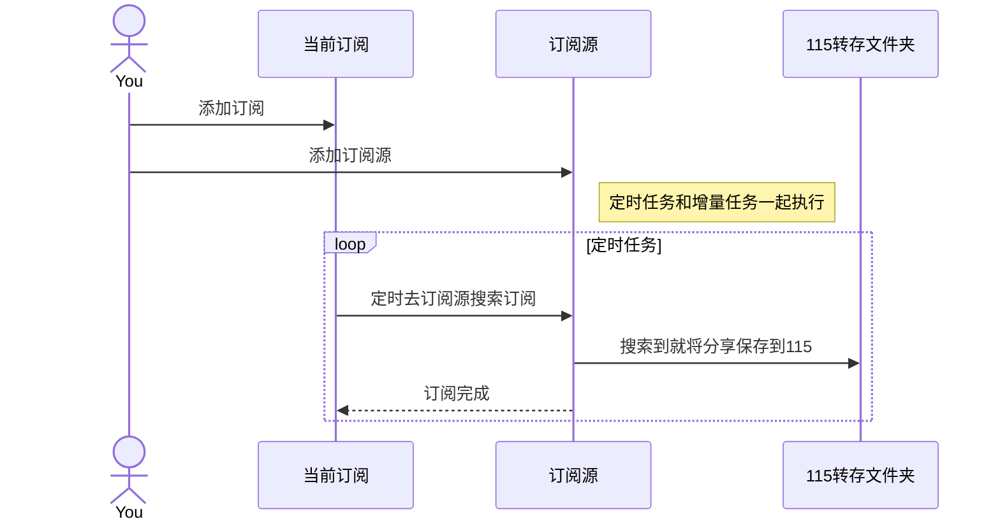
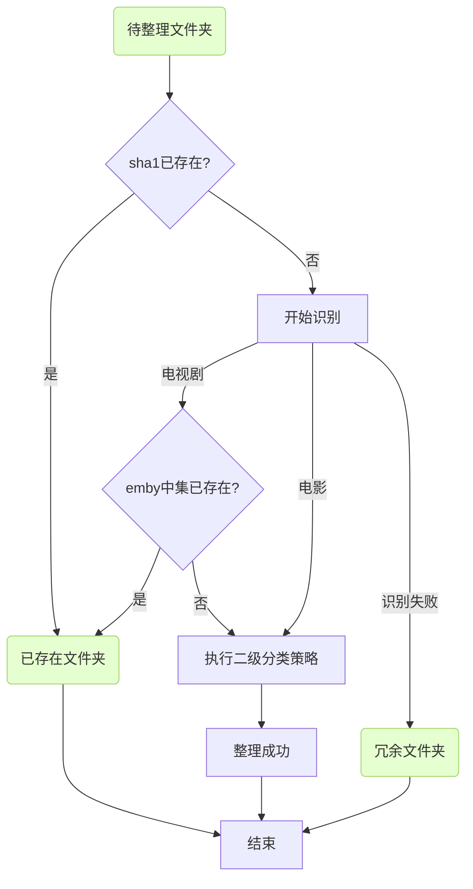

# 功能图解

## TG订阅

```mermaid
sequenceDiagram
    actor You
    participant 当前订阅
    participant 订阅源
    participant 115转存文件夹
    You->>当前订阅: 添加订阅
    You->>订阅源: 添加订阅源
    Note right of 订阅源:定时任务和增量任务一起执行
    loop 定时任务
        当前订阅 ->> 订阅源: 定时去订阅源搜索订阅
        订阅源 ->> 115转存文件夹: 搜索到就将分享保存到115
        订阅源-->>当前订阅: 订阅完成
    end
```

## 自动整理

```mermaid
graph TD
    A(待整理文件夹) --> B{sha1已存在?}
    B -->|是| C(已存在文件夹)
    C --> Z[结束]
    B -->|否| D[开始识别]
    D -->|电视剧| G{emby中集已存在?}
    G -->|否| J[执行二级分类策略]
    G -->|是| C
    J --> M[整理成功]
    M --> Z
    D -->|电影| J
    D -->|识别失败| K(冗余文件夹)
    K --> Z
    style A fill:#e6ffd0,stroke:#a3d46b
    style C fill:#e6ffd0,stroke:#a3d46b
    style K fill:#e6ffd0,stroke:#a3d46b
```

